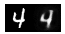

# deeplearnjs-autoencoder

Autoencoder implementation with [deeplearn.js](https://deeplearnjs.org/)

## How to run

```sh
$ npm i
$ npm run dev
```

Then, open `http://localhost:3000` in your browser.

## Results

Learning curve after ~30,000 steps of training (Steps(x)/Cost(y)).


Example outputs after ~30,000 steps of training (Original images on the left, output images on the right)





